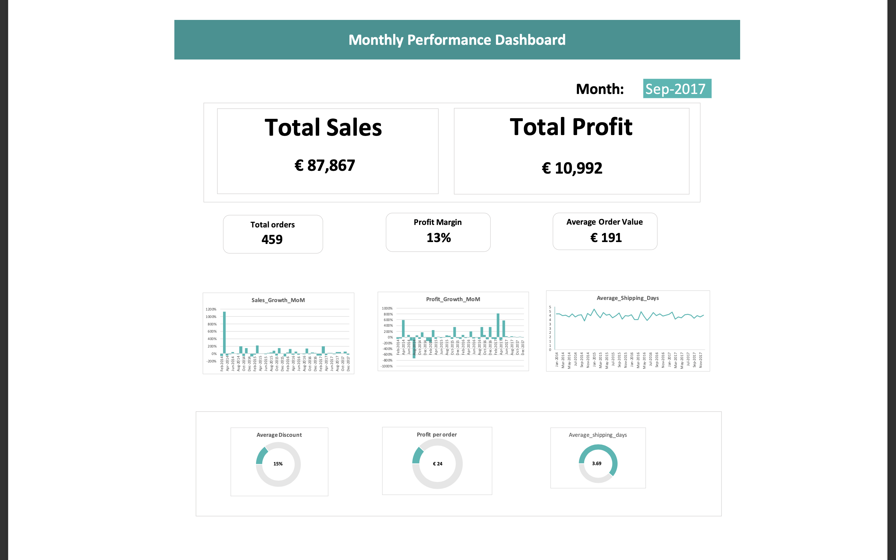

# 📊 Project Overview
**A comprehensive analysis of 48 months of e-commerce sales data to identify profitability trends, optimize discount strategies, and improve business decision-making. This project demonstrates end-to-end data analysis skills including data cleaning, metric calculation, trend analysis, and dashboard creation.**

**Analysis Period: January 2014 - December 2017
Total Records: 48 months of transactional data
Business Impact: Identified profit-loss patterns and discount optimization opportunities.**

🎯 Business Problem
The e-commerce business needed to:

- Understand which months were profitable vs. unprofitable
- Identify the relationship between discounts and profitability
- Track growth patterns and shipping performance
- Create early warning indicators for low-profit periods

## 📁 Dataset Description

| Metric | Description |
|--------|-------------|
| **Total Sales** | Monthly revenue in Euros (€) |
| **Total Profit** | Net profit after costs |
| **Total Orders** | Number of orders processed |
| **Average Shipping Days** | Delivery time performance |
| **Average Discount** | Discount percentage offered |
| **Profit Margin** | Profit as percentage of sales |
| **Sales Growth (MoM)** | Month-over-month sales change |
| **Profit Growth (MoM)** | Month-over-month profit change |

**Data Range:** €4,520 - €118,448 in monthly sales
**Observation Period:** 48 consecutive months

## 🔍 Analysis Approach
1. Data Preparation
- Cleaned and validated 48 months of sales records
- Calculated derived metrics (profit margin, average order value, profit per order)
- Created growth indicators (MoM sales and profit growth)

2. Metric Engineering
- Profit Margin = (Total Profit / Total Sales) × 100
- Average Order Value = Total Sales / Total Orders
- Profit per Order = Total Profit / Total Orders
- Low Profit Indicator = Alert system for profit margins < 5%

3. Trend Analysis
- Identified seasonal patterns in sales and profitability
- Analyzed the correlation between discount rates and profit margins
- Tracked shipping performance consistency

4. Dashboard Creation
- Built an interactive monthly performance dashboard
- Visualized growth trends and shipping metrics
- Created an alert system for underperforming months

## 💡 Key Findings

## 📊 Key Statistics Summary

| Metric | Best Month | Worst Month |
|--------|------------|-------------|
| **Highest Sales** | Nov-2017 (€118,448) | Feb-2014 (€4,520) |
| **Highest Profit** | Dec-2016 (€17,885) | Jan-2015 (-€3,281 loss) |
| **Best Profit Margin** | Oct-2016 (27%) | Jan-2015 (-18%) |
| **Worst Profit Despite Good Sales** | Mar-2014 (€55,691 sales, €499 profit, 1% margin) | - |
| **Most Orders** | Nov-2017 & Sep-2017 (459 orders) | Jan-2015 (58 orders) |

🔴 Critical Issues Identified
1. High Sales ≠ High Profit
- March 2014: Generated €55,691 in sales but only €499 profit (1% margin - worst in dataset)
- Despite decent revenue, extremely poor profitability
- Contributing Factor: 17% discount reduced revenue significantly
- Note: Total costs were approximately €55,192, but the dataset doesn't show a cost breakdown for further analysis

2. Unprofitable Months Detected
- July 2014: Loss of €841 (-2% margin)
- January 2015: Loss of €3,281 (-18% margin)
- April 2017: Only €933 profit (3% margin)

3. Discount Impact
- Months with 17-19% discounts showed consistently lower profit margins
- Average discount of 15% across the period
- Recommendation: Cap discounts at 12-15% to maintain profitability

## 🟢 Positive Trends

1. Strong Performers
- November 2017: Highest sales month (€118,448) with €9,690 profit (8% margin)
- December 2016: €96,999 sales, €17,885 profit (18% margin - excellent profitability)
- October 2016: Highest profit per order (€83) and strong 27% profit margin

2. Operational Consistency 
- Average shipping time: 3.69 days (stable throughout period)
- Maintained 4-day average delivery in 90% of months

3. Growth Volatility
- Month-over-month growth ranged from -74% to +1,132%
- High volatility indicates a need for demand forecasting

## 📈 Business Recommendations
**Immediate Actions**
1. Discount Strategy Review 
- Investigate why March 2014 had 1% margin despite 17% discount being only slightly above average (15%)
- Analyze if specific products or campaigns drove the poor profitability
- Test discount caps at 14% maximum
- Data Gap: Need cost breakdown to understand if the issue was product costs, operational expenses, or other factors

2. Early Warning System
- Use the "Low Profit Indicator" to flag risky months
- When an alert triggers, immediately review discount levels and cost structure

3. Seasonal Planning
- Prepare inventory for high-performing months (Q4: Nov-Dec)
- Reduce overhead during historically low-profit months (Q1: Jan-Feb)

**Strategic Improvements**
4. Profit Optimization
- Target profit margin of 15-20% (current average: ~12%)
- Focus on increasing average order value (currently €191-€305)
- Analyze product mix for March-type months

5. Growth Stabilization
- Reduce month-over-month volatility through better demand forecasting
- Build consistent customer acquisition channels

## 🛠️ Tools & Technologies

- Microsoft Excel: Data cleaning, calculations, and initial analysis
- Excel: Dashboard creation and data visualization
- Data Analysis Techniques: Trend analysis, correlation analysis, metric engineering

## 📊 Dashboard Preview
**The interactive dashboard includes:**
- Monthly Performance KPIs: Sales, profit, orders, margin, average order value
- Trend Visualizations: Shipping days over time, MoM sales growth, MoM profit growth
- Key Metrics Summary: Average discount, profit per order, shipping performance, profit margin
  

***Dashboard showing September 2017 performance with trend analysis***

## ⚠️ Data Limitations & Future Analysis Needs
**While this dataset provides valuable insights into sales and profit trends, it has some limitations:**

**Missing Data:**
- No cost breakdown (COGS, operational expenses, marketing costs)
- No product-level details (which products were sold)
- No customer information (acquisition channels, retention rates)
- No seasonal factors or campaign details

**Questions That Cannot Be Answered:**
- Why were costs high in specific months?
- Which products drive profitability?
- What caused the extreme volatility in growth rates?
- Are discounts attracting new customers or just reducing margins?

**Recommended Additional Data:**
- Product catalog with cost and pricing
- Customer acquisition source
- Marketing spend per month
- Inventory levels and turnover
- Customer lifetime value

## 📂 Project Structure
```
ecommerce-sales-analysis/
│
├── README.md                    # This file
├── data/
│   ├── PROJECT.xlsx            # Raw sales data
│   └── data_dictionary.md      # Column descriptions
│
├── analysis/
│   ├── calculations.xlsx       # Analysis workbook
│   └── insights.md            # Detailed findings
│
├── dashboard/
│   ├── PROJECT_1.xlsx         # Dashboard file
│   └── dashboard_preview.png   # Screenshot
│
└── reports/
    └── final_report.pdf       # Executive summary
```
## 🎓 Learning Outcomes

**Through this project, I developed skills in:**
- Data Cleaning: Handling real-world messy data
- Metric Engineering: Creating meaningful KPIs from raw data
- Trend Analysis: Identifying patterns in time-series data
- Business Intelligence: Translating data into actionable insights
- Data Visualization: Creating clear, informative dashboards
- Critical Thinking: Asking the right questions about the data

## 🚀 Future Improvements
1. Predictive Analytics: Build a forecasting model for future sales
2. Customer Segmentation: Analyze customer behavior patterns
3. Product Analysis: Deep dive into which products drive profitability
4. Automated Reporting: Create weekly performance alerts

## 📞 Contact & Collaboration
**Author: Adeyemi Toheeb ||** 
**LinkedIn: www.linkedin.com/in/toymat ||**
**Email: toyymat@gmail.com**

## 🙏 Acknowledgments
- The dataset used in this project was sourced from kaggle
- Analysis methodology inspired by real-world business intelligence practices
- Dashboard design follows best practices in data visualization

## ⭐ If you found this project helpful, please give it a star!
**Last Updated:** January 2026
